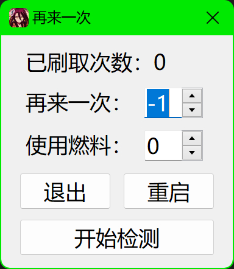

# 再来一次

## 简介

崩坏·星穹铁道刷本自动点击再来一次、使用燃料脚本，简单纯粹

支持分辨率：3840x2160、2880x1800、1920x1080

## 下载方法

> PS: 程序报毒系正常现象，担心的话可以跑源码或者自行编译；更不会导致封号，用别怕怕别用

选择其一即可：

- 方法一：使用编译好的程序（推荐，**下载即用**）

    [<<<点击进入>>>](https://github.com/UCPr251/starRailAuto/releases/latest)release最新版本，下载并运行该exe文件

- 方法二：使用源码

    克隆/下载源码（需已安装好[Autohotkey](https://www.autohotkey.com) v2版解释器），运行[再来一次.ahk](./再来一次.ahk)文件

## 使用方法

- Alt+C ：打开/关闭[控制面板](./控制面板.jpg)，相关信息：

  > **已刷取次数**：本次检测期间共点击“再来一次”的次数，重新开始检测时重置
  >  **再来一次**：点击“再来一次”的次数。-1则循环直至体力耗尽
  >  **使用燃料**：自动使用燃料的个数。设置后每次体力耗尽时自动使用一个燃料
  >  **开始检测**：点击后开始检测“再来一次”界面。手动进入需要刷取的副本后点击此按钮，后续即可由脚本自动点击“再来一次”

控制面板图例：

    

示例：设进入副本后点击开始检测，此时剩余120体力，每次刷取消耗40体力

- **再来一次**设置为-1，**使用燃料**设置为0时：脚本将点击3次再来一次（体力耗尽，自动停止），剩余0体力

- **再来一次**设置为2，**使用燃料**设置为0时：脚本将点击2次再来一次（任务完成，自动停止），剩余40体力

- **再来一次**设置为4，**使用燃料**设置为0时：脚本将点击3次再来一次（体力不足，自动停止），剩余0体力

- **再来一次**设置为-1，**使用燃料**设置为1时：脚本将点击3次再来一次，此时体力耗尽；第4次会自动使用1个燃料，此次刷取完毕后停止（体力耗尽，自动停止），剩余20体力

- **再来一次**设置为5，**使用燃料**设置为3时：脚本将点击3次再来一次，此时体力耗尽；第4次会自动使用1个燃料，此次刷取完毕后剩余20体力；第5次会再次使用1个燃料，此次刷取完毕后停止（任务完成，自动停止），剩余40体力